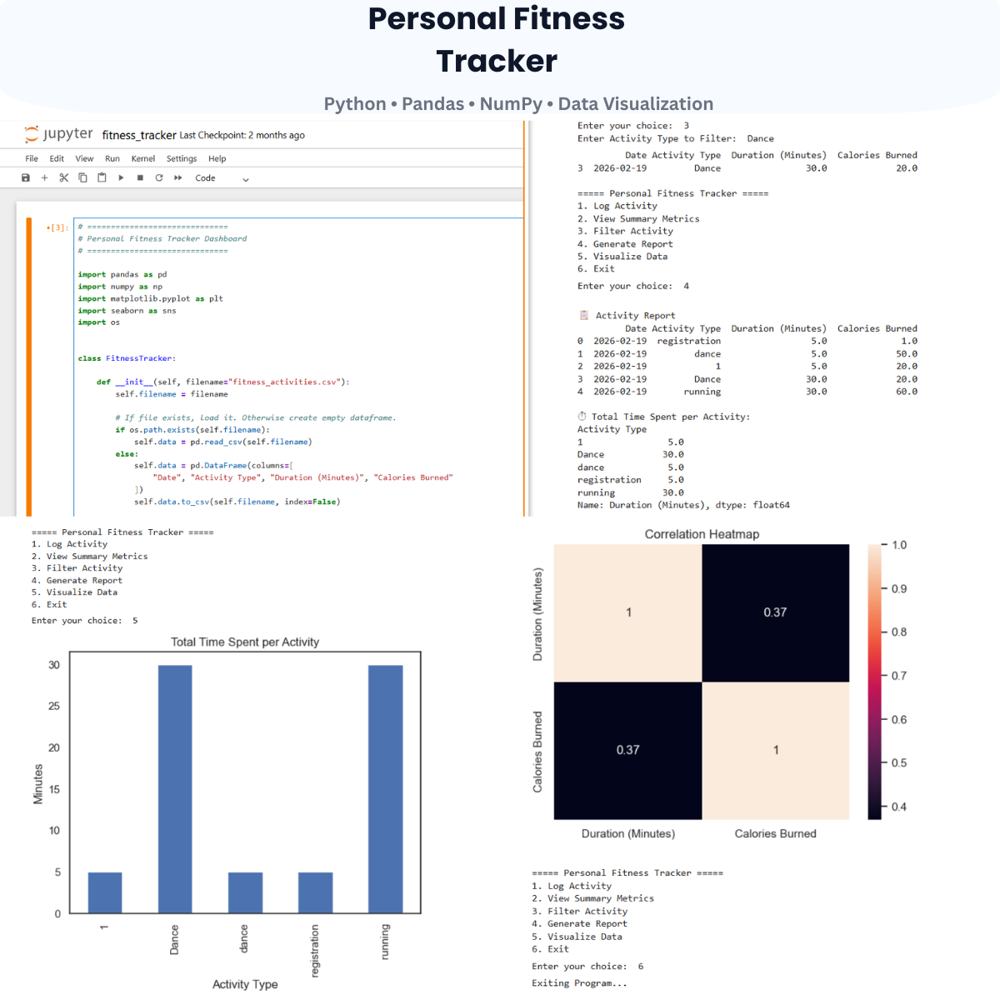

# 🚀 Personal Fitness Tracker

A beginner-friendly Python project focused on fitness activity tracking, data analysis, and visualization techniques.

## 📌 About This Project
This repository contains:
- Personal fitness activity tracker
- Activity logging and filtering
- Summary metrics and reports
- Data visualization and heatmaps
- CSV-based data handling
- Beginner-friendly coding exercises
- AI/ML preparation content

## 📂 Files Included
- `fitness_tracker.ipynb` → Jupyter Notebook containing the Personal Fitness Tracker project
- `fitness_activities.csv` → Dataset used for storing fitness activities
- `Personal Fitness Tracker.png` → Output screenshot of the project

## 🛠 Technologies Used
- Python
- Pandas
- NumPy
- Matplotlib
- Seaborn
- Jupyter Notebook

## 🎯 Learning Goals
This project helps in understanding:
- Data analysis fundamentals
- Fitness data tracking
- CSV file handling
- Data visualization techniques
- Python concepts for AI/ML

## 📸 Project Output

## 👨‍💻 Author
**Yashraj Sharma**

---
⭐ If you like this project, don't forget to star the repository.
